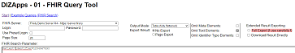
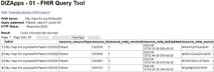

# FHIR Search and Transformation Tool (FST&sup2;)

The UKL-DIZApps provided here were developed by the Data Integration Center of the University of Leipzig Medical Center (Universitätsklinikum Leipzig AöR). The development is part of the project "SMITH - Medizininformatik-Konsortium - Beitrag Universitätsklinikum Leipzig" granted by the Federal Ministry of Education and Research with grant no. 01ZZ1803D. This grant was given within the Medical Informatics Initiative (MI-I) of the German government.

<div align=right>
 &nbsp;&nbsp;
 &nbsp;&nbsp;

</div>

Current UKL-DIZApps release: 2022-12-20

## Description
UKL-DIZApps is a tool collection for handling FHIR data without knowledge about scripting or software development. 

Currently there is one toolgroup provided with UKL-DIZApps. 
- **FST&sup2; - FHIR Search and Transformation Tool**  
The app runs FHIR Search queries to FHIR server that are configured in the app config. The query results can be provided in different formats (FHIR json, structured HTML, flat tables). The app can be used via its web GUI or via its REST interface. For information about FHIR Search see [https://hl7.org/fhir/search.html](https://hl7.org/fhir/search.html).

## Content
- [FHIR Search and Transformation Tool (FST&sup2;)](#fhir-search-and-transformationtool-fst)
  * [Description](#description)
  * [Content](#content)
  * [Installation and Running](#installation-and-running)
    + [Downloading](#downloading)
    + [Running on Windows](#running-on-windows)
      - [Simple Startup](#simple-startup)
      - [Windows Service](#windows-service)
      - [Stopping Behaviour](#stopping-behaviour)
    + [Running on Linux](#running-on-linux)
    + [Running on Docker](#running-on-docker)
    + [Additional information](#additional-information)
      - [3rd party tools](#3rd-party-tools)
      - [Security](#security)
  * [Configuration](#configuration)
    + [Config for FST&sup2;](#config-for-fst)
      - [Core config items](#core-config-items)
      - [Nginx config](#nginx-config)
      - [Auth data](#auth-data)
  * [Usage](#usage)
    + [FST&sup2; - FHIR Search and Transformation Tool](#fst---fhir-search-and-transformation-tool)
      - [Using the app with a web browser](#using-the-app-with-a-web-browser)
      - [Using the app REST interface with generic tools](#using-the-app-rest-interface-with-generic-tools)
  * [Support](#support)
  * [TODO](#todo)
  * [Contributing](#contributing)
  * [License](#license)

## Description
UKL-DIZApps is a tool collection for handling FHIR data without knowledge about software creation. 

Currently there is only one toolgroup provided with UKL-DIZApps. 
- **FST&sup2; - FHIR Search and Transformation Tool**  
The app runs FHIR Search queries to FHIR server that are configured in the app config. The query results can be provided in different formats (FHIR json, structured HTML, flat tables). The app can be used via its web GUI or via its REST interface. For information about FHIR Search see [https://hl7.org/fhir/search.html](https://hl7.org/fhir/search.html).

Other Apps will follow.

## Downloading and Running
### Downloading
Choose an archive file (**DIZApp01_\<timestamp\>.\<ext\>**) from the download folder of the UKL-DIZApps repository, download it and unpack it to a location of your choice.  
**CAUTION:** Be careful with the acess settings for the unpacked folder. Inappropriate access to the app and its configuration may cause illegal access to your FHIR data.

### Running on Windows
#### Simple Startup
From the folder you unpacked the archive to just start the **DizApp01.exe** file. See below for the configuration opportunities. The DizApp01.exe file is a Windows console app that starts all components needed, including the Python environment and the Nginx server bundled here. 

FST&sup2; can be configured to run in **workstation mode** or **server mode** (see section "Configuration" below). Workstation mode is the default setting. In this mode, after starting the server engine, the default webbrowser of the current user is called with the start page of the app.

#### Windows Service
FST&sup2; may be executed as a Windows service. Use the **DizApp01Service.exe** as service executable. 

The service can be installed and run using **DizApp01InstallService.exe**. To remove the service, use **DizApp01RemoveService.exe**. Alternatively, you may use your favorite other system management tools to install or remove the service.

DizApp01InstallService.exe and DizApp01RemoveService.exe run without parameters.

#### Stopping Behaviour
When being closed/stopped, DizApp01.exe and DizApp01Service.exe also stop their subprocesses for Python and Nginx. This stopping behaviour may fail on systems with a very high CPU load; usually Windows grants a 5 seconds period of time before running into a timeout. 

### Running on Linux
A deployment for Linux based usage of FST&sup2; will be available soon.

### Running on Docker
A deployment for Docker based usage of FST&sup2; will be available soon.

### Additional information
#### 3rd party tools
FST&sup2; is provided including the 3rd party tools needed to start/use them: 
- Python and 
- Nginx.

You find subfolders for both tools in the root folder of the install folder.

The core code of FST&sup2; is written in Python. From the Python environment that is bundled here some unnecessary components have been removed. 

#### Security
Nginx is used to wrap SSL around the app, so that secure access can be configured. You may also add additional authentication options and other restrictions to the nginx config. See the Nginx documentation in the web for further information.

Towards the FHIR servers used, the DIZApp01 backend acts as an HTTP(S) client. So you can, for example, define username/password or client certificates for authenticating DIZApp01 to a FHIR server. See the section "Auth data" below in "Configuration".

## Configuration
The DizApp01 subfolder contains a **dizapp01.conf** file. The configuration elements are named in a self explaining way. There are some comments provided to explaine the configuration.

If you change the configuration while the app / the service is running, restart it to apply the changes.

### Config for FST&sup2;
#### Core config items
```
# App Server Settings

## The app engine runs as a webserver based on the Python Flask module.
##   It listens at localhost / 127.0.0.0 using the appServerPort given here. 
## Access from other machines using SSL is provided via Nginx - see the 
##   separate NGinx config files, e. g. for the port Nginx is listening on.
##   CAUTION: The Nginx settings must match the appServerPort and the 
##   appSslServerPort given here.
##   You may add additional access settings, e. g. basic auth, in the Nginx
##   config.
appServerPort: 8071
appSslServerPort: 8070

## Valid appModes are: Server|Workstation
##   In Workstation mode, after starting the server engine, the default webbrowser 
##   of the current user is called with the start page of the app.
##   This feature is only available when using DIZApp01.exe for starting the app.
##   Otherwise Server mode is assumed and the browser call is skipped.
appMode: Workstation

# FHIR server settings
defaultFhirServer: fhirServer001

fhirServer001_name: Firely Demo Server R4
fhirServer001_url: https://server.fire.ly
fhirServer001_port: 443
fhirServer001_path: /r4
fhirServer001_timeout: 60
fhirServer001_verifySsl: False
fhirServer001_applyFirelyPageLinkCorrection: True

fhirServer002_name: <...>
<...>

# Misc settings

## This page size is demanded from the FHIR server when using Full-Export mode. 
## FHIR servers my restrict the maximum page size to a lower value by server configuration.
fhirServerFullExportPageSize: 200

defaultFhirSearchString: Patient?identifier=1234567890

## Put the Byte Order Mark (BOM) for UTF-8 into CSV export files: hex byte sequence 0xEF,0xBB,0xBF
## If applying the UTF8-BOM, some older applications may deny proper reading of the CSV files.
csvExportApplyUtf8BomTag: True
```

#### Nginx config
For the configuration of the Nginx bundled here see the config files in the nginx folder. For example, the predefined config provided here defines port 8070 for listening.

Please adjust the Nginx config according to your needs. For example, you may want to configure authentification methods and certificates. For documentation see the Nginx pages in the Web.
**CAUTION:** The predefined config provided here contains a self signed certificate-key-pair for the SSL connections. It is highly recommended to replace the certificate/key by your own trustworthy files. 

#### Auth data
DizApp01 can be configured to use **Basic Auth**, **Client Cert Auth** to FHIR servers - if needed.
- Login data for Basic Auth can be entered to the GUI but may also be predefined. 
- Login data for Client Cert Auth can only be predefined. 

The DizApp01 folder contains a subfolders named sec. There you find files to store the predefined auth data - if you want.  
**CAUTION:** Be careful with the access rights of the predefined auth data! 

Predefining auth data may especially be useful when using the app in server mode; it is mandatory in server mode and workstation mode when a FHIR server needs Client Cert Auth.

## Usage

### FST&sup2; - FHIR Search and Transformation Tool
The app runs FHIR search queries to FHIR servers that are configured in the app config (see above).

When installed and started (see section "Installation and Running"), the app acts as a web service that can be accessed via up-to-date web browsers or other REST enabled tools like Postman.

The app web service listens to HTTP requests locally (localhost; 127.0.0.1) at the port defined in dizapp01.conf (default: 8071). It listens to HTTPS requests at the port given in the Nginx config in the separate nginx subdirectory (default: 8070).

#### Using the app with a web browser
In Workstation mode (see the configuration section), after starting the server engine the app automatically calls the start page of the app using the default webbrowser.

For opening the start page manually, point your web browser to 
- [http://localhost:8071](http://localhost:8071) or
- [https://\<hostname\>:8070](https://\<hostname\>:8070)

Use other port numbers, if they were changed in the config of your installation.

Fill in and adjust the query parameters.

[](./doc/doc001.png)

Query results are opened in separate browser tabs/windows.

[](./doc/doc002.png)

#### Using the app via REST interface 
Instead of using the app GUI via web browser, you may call the query interface of the app via REST calls. So you could integrate the app into a tool chain, for example to convert FHIR search query results to CSV format "on the fly".

Parameters for the REST calls have to be provided via POST method.

|Parameter name|Example value|
|---|---|
|newQuery|newQuery|
|fhirServer|fhirServer001|
|fhirServerLogin|username|
|fhirServerPw|password|
|resultPageSize|20|
|outputMode|outputMode01 (=Raw Bundles)  outputMode02 (=Raw with separated resources)  outputMode03 (=Structured HTML)  outputMode04 (=Table (simple))  outputMode05 (Table (fully flattened))|
|omitMeta|omitMeta|
|omitText|omitText|
|omitIdentifierType|omitIdentifierType|
|exportResultMode|expFull|
|resultDownloadDirectly|resultDownloadDirectly|
|searchParameters|Patient?identifier=1234567890|

## Support
Please contact DIZ@medizin.uni-leipzig.de.

## TODO
- Install package / helper apps for usage in Linux / Docker
- <Tell us!> 

## Contributing
We are open to contributions from our partners within the SMITH consortium and the Medical Informatics Initiative (MII). Please contact us via DIZ@medizin.uni-leipzig.de to discuss and arrange contributions together. 

## License
UKL-DIZApps - including FST&sup2; - code and config files are licensed with the GNU GENERAL PUBLIC LICENSE.
For additional tools bundled with UKL-DIZApps (Python, Nginx) see their separate license files.
