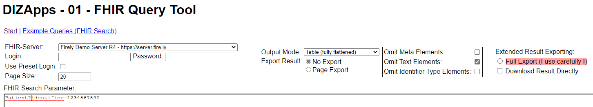
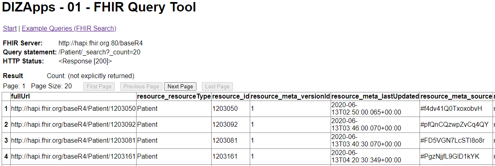

# DIZApps

The DIZApps provided here were developed in a project granted by the Federal Ministry of Education and Research with grant no. 01ZZ1803D.

[[__TOC__]]

## Description
DIZApps is an app collection providing some tools for handling DIZ data. 

Currently there is only one App provided with DIZApps. 
- DIZApps01 - FHIR Query Tool  
The app runs FHIR search queries to FHIR server that are configured in the app config. The query results can be presented in different formats (FHIR json, structured HTML, flat tables).

Other DIZApps will follow.

## Installation and Running
### General information
DIZApps are provided including the 3rd party tools needed to start/use them: 
- Python and 
- Nginx. 

The core code of DIZApps is written in python. From the Python environment bundled here some components that are not needed have been removed. 

Nginx is used to wrap SSL around the apps. 

### Windows
#### Simple Startup
Download the project tree and just start the **DizAppXX.exe** file from the DizAppXX folder (currently only DizApps01.exe in the DizApps01 folder). See below for the configuration opportunities.

The DizAppXX.exe file is a Windows console app that starts all components needed, including the Python environment and the Nginx server bundled here. 

DizAppXX.exe also kills the corresponding Python and Nginx processes when being closed itself. 
ATTENTION: This closing behaviour may fail on systems with a very high CPU load; Windows grants a 5 seconds period of time to finish the closing tasks. 

#### Windows Service
A DizAppXX may be executable as a Windows service. Then the DizAppXX folder contains a **DizAppXXService.exe**. The service executable can be activated/installed using the **DizAppXXInstallService.exe** tool - or using your favorite other system management tools.

DizAppXXInstallService.exe runs without parameters to install the Windows service. It takes the parameter 'remove' from the command line to remove the service.

### Linux
A deployment for Linux based usage of DIZApps will be available within May 2022.

### Docker
A deployment for Docker based usage of DIZApps will be available within May 2022.

## Configuration
Each DizAppXX folder contains a  
**dizappXX.conf**   
file.  
We tried to name the configuration elements in a self explaining way and provided some comments explaining the configuration. 

### Config for DizApp01
#### Core config items
```
# App Server Settings

## The app engine runs as a webserver based on the Python Flask module.
## It listens at localhost / 127.0.0.0 using the port given here. Access from other machines is provided via Nginx - see the separate NGinx config files. 
appServerPort: 8095

## Valid appModes are: Server|Workstation
## In Workstation mode, after starting the server engine, the default webbrowser 
## of the current user is opened with the start page of the app.
## In Server mode, this step is skipped, but a nginx is started for wrapping SSL around the app.
appMode: Server

# FHIR server settings
defaultFhirServer: fhirServer001

<External FHIR servers for testing...>
fhirServer001_name: Firely Demo Server R4
fhirServer001_url: https://server.fire.ly
fhirServer001_port: 443
fhirServer001_path: /r4
fhirServer001_timeout: 60
fhirServer001_verifySsl: False
fhirServer001_applyFirelyPageLinkCorrection: True

<Some additional test FHIR servers are defined in the predefined config. >

<Don't forget to define your own local FHIR servers.>
fhirServer101_name: 
fhirServer101_url: 
fhirServer101_port: 
fhirServer101_path: 
fhirServer101_timeout: 
fhirServer101_verifySsl: 
fhirServer101_applyFirelyPageLinkCorrection: 

fhirServer102_name: <...>
<...>

# Misc settings

## This page size is demanded from the FHIR server when using Full-Export mode. 
## FHIR servers my restrict the maximum page size to a lower value by server configuration.
fhirServerFullExportPageSize: 200

defaultFhirSearchString: Patient?identifier=1234567890

## Put the Byte Order Mark (BOM) for UTF-8 into CSV export files: hex byte sequence 0xEF,0xBB,0xBF
## If applying the UTF8-BOM, some older applications may deny proper reading of the CSV files.
csvExportApplyUtf8BomTag: True
```
#### Nginx config
For the configuration of the Nginx bundled here see the config files in the nginx folder. The predefined config provided here defines port 8094 for listening and a self signed certificate-key-pair for the SSL connections.

Please adjust the Nginx config according to your needs. For example, you may want to configure authentification methods. For documentation see the Nginx pages in the Web.

#### Predefined auth data
DizApp01 uses basic auth for authenticating to FHIR servers (other methods will follow). Login data can be entered to the GUI but may also be predefined. This may be useful when using the app in server mode.
The DizApp01 folder contains a subfolders named sec. There you find files to store the predefined auth data - if you want. Be careful with the access rights! 

## Usage

### DIZApp01 - FHIR Query Tool
The app runs FHIR search queries to FHIR servers that are configured in the app config (see above).

When installed and started (see section "Installation and Running"), the app acts as a web service that can be accessed via up-to-date web browsers or other REST enabled tools like Postman.

The app web service listens to HTTP requests locally (localhost; 127.0.0.1) at the port defined in dizapp01.conf (default: 8095). It listens to HTTPS requests at the port given in the Nginx config in the separate nginx subdirectory (default: 8094).

### Using the app with a web browser
Point your web browser to 
- http://localhost:8095 or
- https://<hostname>:8094  
Change the default port numbers according to your config.



Query results are opened in separate browser tabs/windows.



### Using the app REST interface with generic tools
You may call the query interface of the app via generic REST calls. Parameters have to be provided via POST method.

|Parameter name|Example value|
|---|---|
|newQuery|newQuery|
|fhirServer|fhirServer001|
|fhirServerLogin|username|
|fhirServerPw|password|
|resultPageSize|20|
|outputMode|outputMode01 (=Raw Bundles)  outputMode02 (=Raw with separated resources)  outputMode03 (=Structured HTML)  outputMode04 (=Table (simple))  outputMode05 (Table (fully flattened))|
|omitMeta|omitMeta|
|omitText|omitText|
|omitIdentifierType|omitIdentifierType|
|exportResultMode|expFull|
|resultDownloadDirectly|resultDownloadDirectly|
|searchParameters|Patient?identifier=1234567890|

## Support
Please contact DIZ@medizin.uni-leipzig.de.

## TODO
- Certificate based authentication to the FHIR Servers
- Install package / helper apps for usage in Linux / Docker
- <Tell us!> 

## Contributing
We are open to contributions from our partners within the SMITH consortium and the Medical Informatics Initiative (MII). Please contact us via DIZ@medizin.uni-leipzig.de to discuss and arrange contributions together. 

## License
DIZApps code and config files are licensed with the GNU GENERAL PUBLIC LICENSE.
For additional tools bundled with DIZApps (Python, Nginx) see their separate license files.
